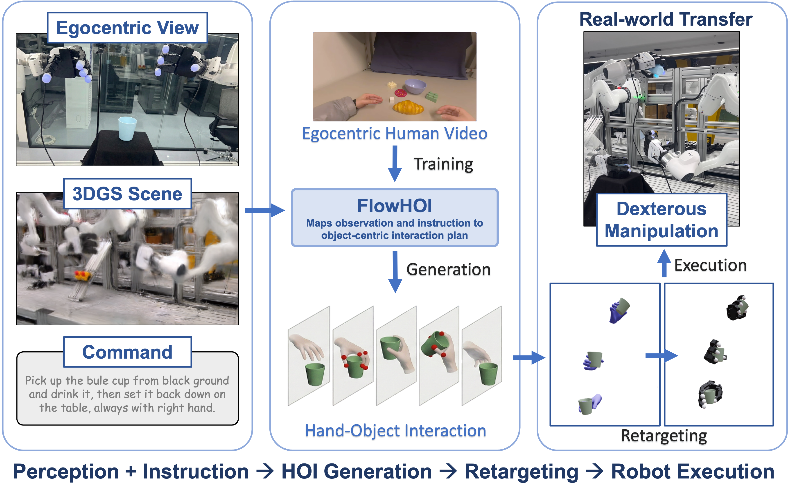

  <h1 align="center"><strong>FlowHOI: Flow-based Semantics-Grounded Generation of Hand-Object Interactions for Dexterous Robot Manipulation</strong></h1>
  

    <a href="https://huajian-zeng.github.io/">Huajian Zeng</a>1, <a href="https://scholar.google.com/citations?user=vdo-1aYAAAAJ&hl">Lingyun Chen</a>2, <a href="https://scholar.google.com/citations?hl=zh-CN&user=f7ox7CIAAAAJ">Jiaqi Yang</a>1, <a href="https://scholar.google.com/citations?user=Lh2CthAAAAAJ&hl">Yuantai Zhang</a>1, <a href="https://fanshi14.github.io/me/">Fan Shi</a>3, <a href="https://ethliup.github.io/">Peidong Liu</a>4, <a href="https://xingxingzuo.github.io/">Xingxing Zuo</a>1,*
     
    1Mohamed Bin Zayed University of Artificial Intelligence (MBZUAI), 2Technical University of Munich (TUM), 3National University of Singapore (NUS), 4Westlake University
     
    *Corresponding author
     
  

  
<strong>In Submission</strong>

## 🔥 Highlight 

**FlowHOI** is a two-stage flow-matching framework that generates semantically grounded, temporally coherent hand-object interaction (HOI) sequences for dexterous robot manipulation.

By decoupling geometry-centric grasping from semantics-centric manipulation and conditioning on 3D Gaussian splatting scene reconstruction, FlowHOI achieves **1.7× higher physics simulation success rate** and **40× inference speedup** compared to the strongest diffusion-based baseline.

These capabilities enable **real-robot execution on diverse dexterous manipulation tasks**, bridging the gap between HOI generation and practical robotic deployment.

    

## 📢 The code will be released after the paper is accepted. Stay tuned!
